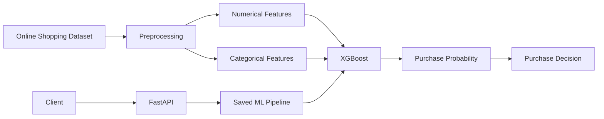

# 🛒 E-Commerce Purchase Prediction


An end-to-end machine learning system that predicts whether an online shopping session will result in a purchase based on customer browsing behavior.

The project covers **EDA → preprocessing → model training → evaluation → model serialization → REST API deployment**.

---

## 📌 Overview

E-commerce platforms generate large amounts of behavioral data during every customer session.

A visitor may browse products, spend time on different pages, return to the website, arrive through different traffic sources, or interact with informational content.

The objective of this project is to learn these behavioral patterns and estimate the probability that a session will result in a purchase.

### Key capabilities

- Exploratory Data Analysis
- Numerical and categorical preprocessing
- XGBoost classification
- Purchase probability prediction
- Feature importance analysis
- Model evaluation
- Serialized ML pipeline
- FastAPI REST API
- Swagger API documentation

---

# 🎯 Problem Statement

Most online shopping sessions do not result in a purchase.

The goal is to predict:

```text
Will this session result in a purchase?
```

using session-level features such as:

- Product pages visited
- Product browsing duration
- Bounce rate
- Exit rate
- Page value
- Visitor type
- Month
- Traffic type
- Weekend behavior

The target variable is:

```text
Revenue
0 → No Purchase
1 → Purchase
```

---

# 📊 Dataset

The project uses the **Online Shoppers Purchasing Intention Dataset**.

Dataset size:

```text
12,330 sessions
18 features
```

Important features include:

| Feature | Description |
|---|---|
| Administrative | Administrative pages visited |
| Administrative_Duration | Time spent on administrative pages |
| Informational | Informational pages visited |
| Informational_Duration | Time spent on informational pages |
| ProductRelated | Product pages visited |
| ProductRelated_Duration | Time spent on product pages |
| BounceRates | Session bounce rate |
| ExitRates | Session exit rate |
| PageValues | Page value |
| Month | Session month |
| VisitorType | Visitor category |
| TrafficType | Traffic source |
| Weekend | Weekend session |
| Revenue | Purchase target |

---

# 🔎 Exploratory Data Analysis

The project generates six visualizations to understand purchasing behavior.

## Purchase Distribution


Most sessions do not result in a purchase, making class imbalance an important consideration during model evaluation.

---

## Purchase Rate by Visitor Type


This analysis compares purchasing behavior between different visitor categories, including new and returning visitors.

---

## Purchase Rate by Month


Purchase behavior varies across months, making seasonal/session timing information useful for prediction.

---

## Page Value Distribution


The distribution shows how page value differs between purchasing and non-purchasing sessions.

---

## Product-Related Duration


Time spent on product-related pages provides an important behavioral signal. Users spending more time exploring products may demonstrate stronger purchase intent.

---

## Feature Importance


XGBoost feature importance is used to identify the variables contributing most strongly to the model.

---

# 🏗 System Architecture



### Data Flow

```text
Dataset
   ↓
Data Cleaning
   ↓
Train/Test Split
   ↓
Preprocessing
   ↓
XGBoost
   ↓
Evaluation
   ↓
Model Serialization
   ↓
FastAPI
   ↓
Prediction
```

---

# 🧠 Machine Learning Pipeline

## 1. Preprocessing

Numerical features are handled using median imputation.

Categorical features use:

```text
Most-frequent imputation
        ↓
One-hot encoding
```

The preprocessing and model are combined into a single Scikit-learn pipeline.

This ensures that training and API inference use the same transformations.

---

## 2. Train/Test Split

The dataset is divided into:

```text
80% Training
20% Testing
```

Stratification is used to preserve the target class distribution.

---

## 3. Model

The final classifier is **XGBoost**.

Configuration:

| Parameter | Value |
|---|---:|
| n_estimators | 200 |
| max_depth | 5 |
| learning_rate | 0.05 |
| subsample | 0.8 |
| colsample_bytree | 0.8 |
| eval_metric | logloss |
| random_state | 42 |

XGBoost was selected because gradient boosting performs well on structured/tabular data and can model non-linear relationships between customer behavior and purchase outcomes.

---

# 📈 Model Performance

Evaluation was performed on the held-out test set.

| Metric | Result |
|---|---:|
| Accuracy | **90%** |
| Purchase Precision | **72%** |
| Purchase Recall | **59%** |
| Purchase F1 | **65%** |
| ROC-AUC | **0.931** |

### Interpretation

**90% Accuracy**  
The model correctly classifies approximately 90% of test sessions.

**72% Purchase Precision**  
When the model predicts a purchase, approximately 72% of those predictions are actual purchases.

**59% Purchase Recall**  
The model identifies approximately 59% of the actual purchasing sessions.

**0.931 ROC-AUC**  
The model demonstrates strong separation between purchasing and non-purchasing sessions.

Because the dataset is imbalanced, precision, recall, F1-score and ROC-AUC are considered alongside accuracy.

---

# 🚀 FastAPI Deployment

The trained pipeline is saved as:

```text
model/purchase_prediction.pkl
```

FastAPI loads this model and exposes a prediction endpoint.

Start the API:

```bash
uvicorn app:app --reload
```

Open Swagger documentation:

```text
http://127.0.0.1:8000/docs
```

---

## API Endpoint

### `POST /predict`

Example request:

```json
{
  "Administrative": 3,
  "Administrative_Duration": 100,
  "Informational": 2,
  "Informational_Duration": 50,
  "ProductRelated": 20,
  "ProductRelated_Duration": 1000,
  "BounceRates": 0.02,
  "ExitRates": 0.05,
  "PageValues": 10,
  "SpecialDay": 0,
  "Month": "Nov",
  "OperatingSystems": 2,
  "Browser": 2,
  "Region": 1,
  "TrafficType": 2,
  "VisitorType": "Returning_Visitor",
  "Weekend": false
}
```

Example response:

```json
{
  "purchase_probability": 0.2013,
  "will_purchase": false
}
```

---

# 🛠 Technology Stack

| Technology | Purpose |
|---|---|
| Python | Main programming language |
| Pandas | Data processing |
| NumPy | Numerical operations |
| Scikit-learn | Preprocessing and evaluation |
| XGBoost | Machine learning model |
| Matplotlib | EDA visualization |
| Joblib | Model serialization |
| FastAPI | REST API |
| Uvicorn | API server |
| Git | Version control |
| GitHub | Repository hosting |

---

# 📁 Project Structure

```text
ecommerce-purchase-prediction/
│
├── data/
│   └── online_shoppers_intention.csv
│
├── model/
│   └── purchase_prediction.pkl
│
├── reports/
│   └── figures/
│       ├── purchase_distribution.png
│       ├── purchase_by_visitor.png
│       ├── purchase_by_month.png
│       ├── page_value_distribution.png
│       ├── product_duration_purchase.png
│       └── feature_importance.png
│
├── src/
│   ├── train.py
│   └── eda.py
│
├── app.py
├── requirements.txt
├── README.md
└── .gitignore
```

---

# ⚙️ Quick Start

### Clone

```bash
git clone https://github.com/NextLinePlease/ecommerce-purchase-prediction.git
cd ecommerce-purchase-prediction
```

### Create environment

```bash
python -m venv venv
venv\Scripts\activate
```

### Install dependencies

```bash
pip install -r requirements.txt
```

### Train model

```bash
python src/train.py
```

### Generate visualizations

```bash
python src/eda.py
```

### Start API

```bash
uvicorn app:app --reload
```

Then open:

```text
http://127.0.0.1:8000/docs
```

---

# 🚧 Future Improvements

The current project provides the core ML and API pipeline. A production version could be extended with:

- Advanced session-level feature engineering
- SHAP-based model explainability
- Model calibration
- Threshold optimization
- Model comparison with LightGBM and CatBoost
- Real-time event streaming
- Redis-based feature storage
- Model monitoring and drift detection
- Docker deployment
- Continuous model retraining

---

# 🎓 What This Project Demonstrates

```text
Data Analysis
      ↓
Feature Preprocessing
      ↓
Machine Learning
      ↓
Model Evaluation
      ↓
Model Serialization
      ↓
REST API
      ↓
Production-Oriented ML Workflow
```

This project demonstrates practical experience with **tabular machine learning, preprocessing pipelines, XGBoost, model evaluation, API development, and ML deployment**.

---

## 👨‍💻 Author

**Vansh Kumar**  
B.Tech — Engineering Physics, IIT Patna
