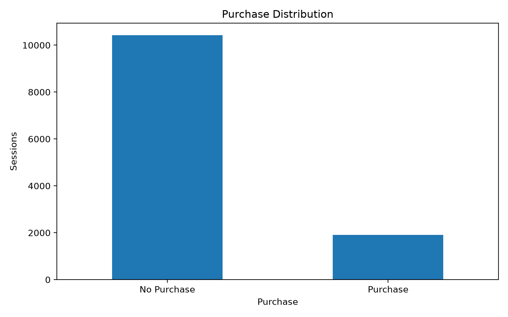
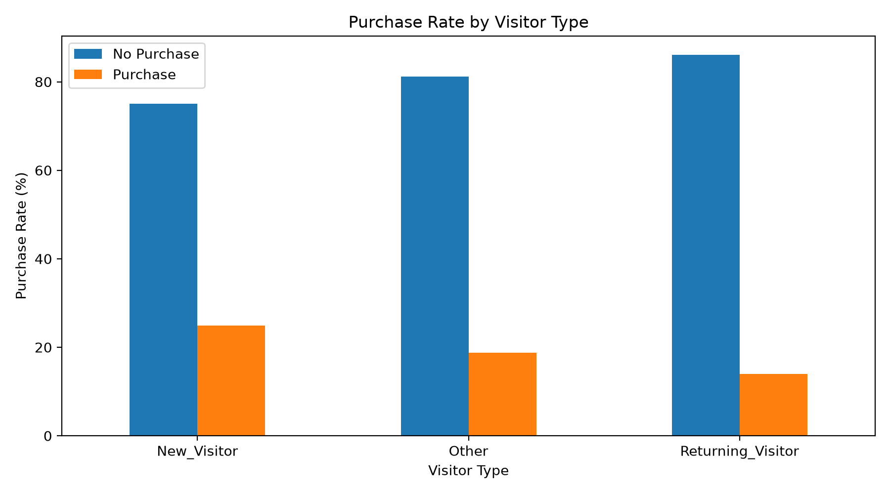
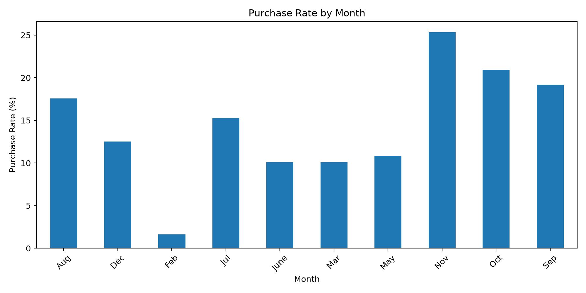
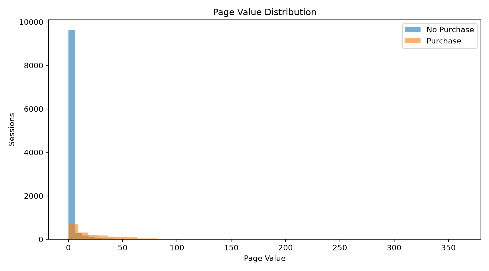
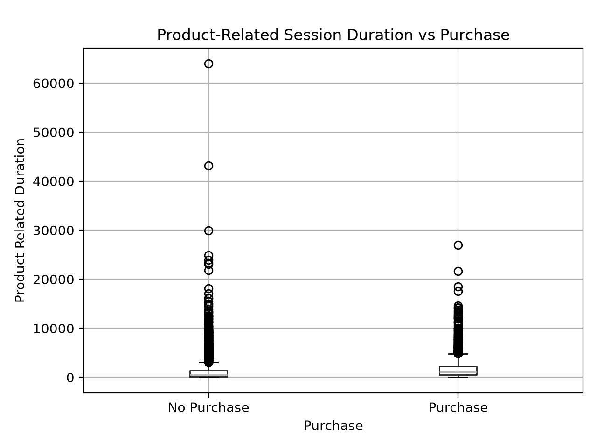
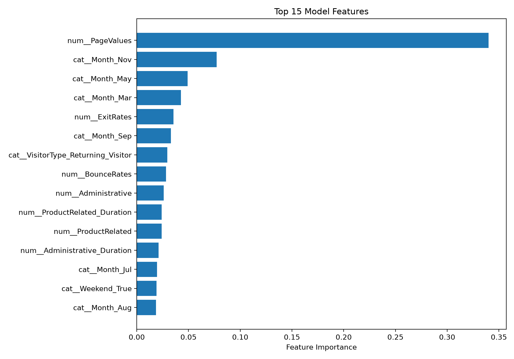
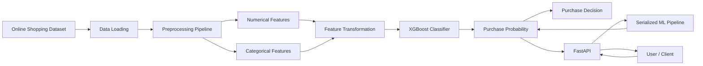

<p align="center">

# 🛒 E-Commerce Purchase Prediction

### Machine Learning System for Predicting Customer Purchase Intent from Online Shopping Sessions

A production-oriented machine learning project that analyzes online shopping session behavior and predicts whether a visitor is likely to complete a purchase.

</p>

---

## 📌 Overview

E-commerce platforms generate enormous amounts of behavioral data during every customer session.

A visitor may:

- Browse multiple product pages
- Spend significant time on product pages
- Visit informational pages
- Return to the website multiple times
- Interact with administrative pages
- Arrive through different traffic sources
- Show different browsing patterns depending on the time of year

The challenge is determining **which sessions are most likely to result in a purchase**.

This project builds an end-to-end machine learning pipeline that takes these session-level behavioral signals and produces a **purchase probability**.

The system consists of:

- Exploratory Data Analysis
- Data preprocessing
- Numerical feature handling
- Categorical feature encoding
- XGBoost classification
- Model evaluation
- Feature importance analysis
- Model serialization
- FastAPI inference service
- REST API for real-time predictions

The final system can be used as a foundation for an e-commerce decision engine that identifies high-intent users and enables businesses to optimize marketing, recommendations, personalization, and customer engagement.

---

# 🚨 The Problem

E-commerce websites receive a large number of sessions every day, but only a fraction of visitors actually purchase something.

A simple metric such as:

> "How many users visited the website?"

does not provide enough information.

Two visitors can generate very different behavioral signals.

### Example

**Visitor A**

- 2 product pages
- Very short session
- High bounce rate
- No page value
- New visitor

**Visitor B**

- 30 product pages
- Long product browsing duration
- Low bounce rate
- Multiple informational interactions
- Returning visitor
- High page value

Visitor B is clearly showing stronger purchase intent.

The objective of this project is to automatically learn these patterns from historical sessions.

---

# 💡 The Solution

We train a supervised machine learning model using historical online shopping sessions.

For every session, the model learns the relationship between:

### User behavior

- Product pages visited
- Product browsing duration
- Administrative pages
- Informational pages
- Bounce rate
- Exit rate
- Page value

### Session characteristics

- Month
- Weekend
- Special day
- Visitor type

### Technical/session attributes

- Operating system
- Browser
- Region
- Traffic type

The model then produces:

```text
Purchase Probability
        ↓
     0.00 - 1.00
        ↓
Purchase Decision
```

For example:

```json
{
  "purchase_probability": 0.2013,
  "will_purchase": false
}
```

This means the model estimates approximately a **20.13% probability of purchase** for that session.

---

# 🎯 Project Objectives

The project focuses on building a complete ML workflow rather than only training a model.

### Primary objectives

1. Understand customer browsing behavior.
2. Identify patterns associated with purchases.
3. Build a robust preprocessing pipeline.
4. Train a gradient boosting classifier.
5. Evaluate classification performance.
6. Analyze important behavioral features.
7. Serialize the trained model.
8. Expose predictions through a REST API.
9. Make the project reproducible and deployable.

---

# 📊 Dataset

This project uses the:

**Online Shoppers Purchasing Intention Dataset**

The dataset contains approximately:

```text
12,330 sessions
18 features
```

The target variable is:

```text
Revenue
```

where:

```text
0 → No purchase
1 → Purchase
```

The dataset contains both numerical and categorical variables, making it suitable for demonstrating a realistic machine learning preprocessing pipeline.

---

# 🧾 Dataset Features

| Feature | Description |
|---|---|
| Administrative | Number of administrative pages visited |
| Administrative_Duration | Time spent on administrative pages |
| Informational | Number of informational pages visited |
| Informational_Duration | Time spent on informational pages |
| ProductRelated | Number of product-related pages visited |
| ProductRelated_Duration | Time spent on product-related pages |
| BounceRates | Average bounce rate |
| ExitRates | Average exit rate |
| PageValues | Average page value |
| SpecialDay | Closeness to a special day |
| Month | Month of the session |
| OperatingSystems | Operating system identifier |
| Browser | Browser identifier |
| Region | Geographic region |
| TrafficType | Traffic source/type |
| VisitorType | New, returning, or other visitor |
| Weekend | Whether the session occurred on a weekend |
| Revenue | Target variable |

---

# 🔎 Exploratory Data Analysis

Before training the model, we analyze the dataset to understand the behavior of purchasing and non-purchasing sessions.

The EDA pipeline generates six visualizations.

---

## 1. Purchase Distribution



This visualization shows the distribution of sessions between:

- Non-purchasing sessions
- Purchasing sessions

The dataset is imbalanced because most website sessions do not result in a purchase.

This is an important observation because accuracy alone can be misleading for imbalanced classification.

For example, a model that predicts:

```text
No Purchase
```

for almost every session could still achieve high accuracy while performing poorly at identifying actual buyers.

Therefore, this project evaluates:

- Precision
- Recall
- F1-score
- ROC-AUC

in addition to accuracy.

---

# 👥 Purchase Rate by Visitor Type



Visitor type provides an important behavioral signal.

The dataset distinguishes between visitors such as:

```text
Returning_Visitor
New_Visitor
Other
```

Analyzing purchase rates by visitor type helps us understand whether returning visitors exhibit stronger purchasing intent.

This feature is especially useful from a business perspective because returning users have already demonstrated previous engagement with the website.

A production recommendation system could use this information together with behavioral features to personalize offers or recommendations.

---

# 📅 Purchase Rate by Month



Customer purchasing behavior can change across different months.

Possible reasons include:

- Seasonal demand
- Holidays
- Marketing campaigns
- Discounts
- Promotional events
- Changes in customer traffic

The model therefore includes `Month` as a categorical feature.

Rather than manually assigning numerical meaning to months, the preprocessing pipeline encodes them using one-hot encoding.

---

# 💰 Page Value Distribution



`PageValues` represents an important signal related to session value.

The visualization compares page value distributions between:

```text
No Purchase
```

and

```text
Purchase
```

Differences between these distributions can reveal whether higher-value browsing sessions are associated with conversions.

This feature can therefore act as an important indicator of purchase intent.

---

# ⏱ Product-Related Session Duration



`ProductRelated_Duration` measures the amount of time users spend interacting with product-related pages.

This feature is particularly intuitive from a business perspective.

A visitor spending significantly more time browsing products may demonstrate stronger purchase intent than someone who leaves the website immediately.

The model learns these relationships automatically instead of relying on manually defined rules.

---

# 🧠 Feature Importance



The project also extracts feature importance from the trained XGBoost model.

The purpose is to understand which input variables contribute most strongly to model predictions.

This provides a basic level of model interpretability.

Instead of treating the model as a complete black box, we can investigate questions such as:

> Which behavioral signals are most useful for identifying potential purchasers?

This is particularly valuable for business applications because model predictions can be translated into actionable customer behavior insights.

---

# 🏗 System Architecture

The project follows a simple production-oriented architecture.



The architecture has two main stages.

### Training Pipeline

```text
Dataset
   ↓
Data Cleaning
   ↓
Train/Test Split
   ↓
Preprocessing
   ↓
XGBoost
   ↓
Evaluation
   ↓
Model Serialization
```

### Inference Pipeline

```text
Client
   ↓
FastAPI
   ↓
Input Validation
   ↓
Saved ML Pipeline
   ↓
Prediction
   ↓
Purchase Probability
   ↓
JSON Response
```

---

# 🔄 Data Flow

The complete data flow is:

### 1. Dataset Loading

The raw CSV dataset is loaded using Pandas.

```python
df = pd.read_csv("data/online_shoppers_intention.csv")
```

---

### 2. Target Preparation

The target variable is converted to an integer representation.

```text
False → 0
True  → 1
```

This allows the classifier to perform binary classification.

---

### 3. Feature / Target Separation

The dataset is divided into:

```text
X → Input features
y → Target variable
```

---

### 4. Feature Type Detection

Features are separated into:

```text
Numerical features
Categorical features
```

This is necessary because different feature types require different preprocessing strategies.

---

### 5. Preprocessing

Numerical features use:

```text
Median imputation
```

Categorical features use:

```text
Most-frequent imputation
        ↓
One-hot encoding
```

---

### 6. Model Training

The processed data is passed into an:

```text
XGBoost Classifier
```

---

### 7. Evaluation

The model is evaluated on an unseen test set using:

- Accuracy
- Precision
- Recall
- F1-score
- ROC-AUC

---

### 8. Model Serialization

The complete pipeline is saved as:

```text
model/purchase_prediction.pkl
```

Because the preprocessing and model are stored together, the inference API does not need to manually reproduce the preprocessing logic.

---

### 9. API Inference

FastAPI loads the serialized pipeline.

The client sends session information.

The API returns:

```text
Purchase probability
Purchase decision
```

---

# 🧠 Machine Learning Pipeline

The ML pipeline is designed to keep preprocessing and model inference together.

This reduces the risk of training-serving inconsistencies.

---

## 1. Data Preprocessing

The first step is loading the dataset and preparing the target.

```python
df["Revenue"] = df["Revenue"].astype(int)
```

The target becomes:

```text
0 → No Purchase
1 → Purchase
```

---

# 2. Feature Separation

The input variables are divided into numerical and categorical groups.

### Numerical

Examples:

```text
Administrative
Administrative_Duration
Informational
Informational_Duration
ProductRelated
ProductRelated_Duration
BounceRates
ExitRates
PageValues
SpecialDay
OperatingSystems
Browser
Region
TrafficType
```

### Categorical

Examples:

```text
Month
VisitorType
Weekend
```

---

# 3. Missing Value Handling

Numerical features use median imputation.

```text
Missing numerical value
        ↓
Median of feature
```

Categorical features use most-frequent imputation.

```text
Missing categorical value
        ↓
Most common category
```

This allows the pipeline to handle incomplete observations without requiring separate preprocessing code during inference.

---

# 4. Categorical Encoding

Machine learning models cannot directly process arbitrary strings such as:

```text
Nov
Returning_Visitor
New_Visitor
```

Therefore categorical variables are transformed using:

```text
OneHotEncoder
```

Unknown categories are ignored during inference using:

```python
handle_unknown="ignore"
```

This is important for API deployment because the production API may receive categories that were not present in a particular training split.

---

# 5. Train/Test Split

The dataset is divided using:

```text
80% → Training
20% → Testing
```

Stratification is used so that the class distribution remains approximately consistent between training and testing datasets.

```python
train_test_split(
    X,
    y,
    test_size=0.2,
    random_state=42,
    stratify=y
)
```

---

# 6. Model

The primary model is:

## XGBoost Classifier

XGBoost is a gradient boosting algorithm based on decision trees.

It is well suited for tabular datasets because it can model:

- Non-linear relationships
- Feature interactions
- Mixed behavioral patterns
- Complex decision boundaries

The configuration used in this project is:

| Parameter | Value |
|---|---:|
| Model | XGBClassifier |
| n_estimators | 200 |
| max_depth | 5 |
| learning_rate | 0.05 |
| subsample | 0.8 |
| colsample_bytree | 0.8 |
| eval_metric | logloss |
| random_state | 42 |

---

# 📈 Model Evaluation

The model was evaluated on the held-out test set.

| Metric | Result |
|---|---:|
| Accuracy | **90%** |
| Purchase Precision | **72%** |
| Purchase Recall | **59%** |
| Purchase F1-score | **65%** |
| ROC-AUC | **0.931** |

---

## Accuracy

The model correctly classifies approximately:

```text
90% of test sessions
```

However, because the dataset is imbalanced, accuracy should not be considered the only important metric.

---

## Precision

Purchase precision:

```text
72%
```

When the model predicts a purchase, approximately 72% of those predictions correspond to actual purchases in the test set.

High precision is useful when false positives have a business cost.

---

## Recall

Purchase recall:

```text
59%
```

The model identifies approximately 59% of the actual purchasing sessions.

Improving recall would be useful for systems where missing a potential customer is expensive.

---

## F1 Score

Purchase F1:

```text
65%
```

F1-score balances precision and recall and is useful when both false positives and false negatives matter.

---

# ⭐ ROC-AUC

The model achieved:

```text
ROC-AUC = 0.931
```

ROC-AUC measures how well the model separates purchasing sessions from non-purchasing sessions across different classification thresholds.

A score close to:

```text
1.0
```

indicates strong discrimination.

The result of approximately:

```text
0.931
```

indicates that the model learned meaningful relationships between session behavior and purchase outcomes.

---

# 💼 Business Interpretation

The model can be used as a customer-intent scoring system.

For example:

```text
Session
   ↓
Purchase Probability
   ↓
Risk / Intent Threshold
   ↓
Business Action
```

A company could define different actions based on predicted probability.

### Low purchase probability

```text
0.00 - 0.30
```

Possible actions:

- Continue normal browsing experience
- Avoid aggressive promotional messaging

### Medium purchase probability

```text
0.30 - 0.70
```

Possible actions:

- Personalized recommendations
- Product suggestions
- Discount experiments

### High purchase probability

```text
0.70 - 1.00
```

Possible actions:

- Personalized offers
- Checkout assistance
- Product recommendations
- Targeted conversion campaigns

These thresholds are illustrative and would need to be optimized using business costs and validation data before production deployment.

---

# 🚀 FastAPI Inference Service

The trained pipeline is exposed through a REST API using FastAPI.

Start the server:

```bash
uvicorn app:app --reload
```

The API runs at:

```text
http://127.0.0.1:8000
```

Interactive API documentation:

```text
http://127.0.0.1:8000/docs
```

FastAPI automatically generates Swagger documentation for the endpoint.

---

# 🔌 API Endpoint

## POST `/predict`

The endpoint accepts a user session and returns a purchase prediction.

### Example Request

```json
{
  "Administrative": 3,
  "Administrative_Duration": 100,
  "Informational": 2,
  "Informational_Duration": 50,
  "ProductRelated": 20,
  "ProductRelated_Duration": 1000,
  "BounceRates": 0.02,
  "ExitRates": 0.05,
  "PageValues": 10,
  "SpecialDay": 0,
  "Month": "Nov",
  "OperatingSystems": 2,
  "Browser": 2,
  "Region": 1,
  "TrafficType": 2,
  "VisitorType": "Returning_Visitor",
  "Weekend": false
}
```

### Example Response

```json
{
  "purchase_probability": 0.2013,
  "will_purchase": false
}
```

The API therefore converts raw session information into a machine learning decision.

---

# 🧪 API Validation

The API uses Pydantic models to validate incoming requests.

For example:

```python
class UserSession(BaseModel):
    Administrative: float
    Administrative_Duration: float
    Informational: float
    Informational_Duration: float
    ProductRelated: float
    ProductRelated_Duration: float
    BounceRates: float
    ExitRates: float
    PageValues: float
    SpecialDay: float
    Month: str
    OperatingSystems: int
    Browser: int
    Region: int
    TrafficType: int
    VisitorType: str
    Weekend: bool
```

This ensures that the API receives data in the expected schema before passing it to the ML pipeline.

---

# 🧱 Project Structure

```text
ecommerce-purchase-prediction/
│
├── data/
│   └── online_shoppers_intention.csv
│
├── model/
│   └── purchase_prediction.pkl
│
├── reports/
│   └── figures/
│       ├── purchase_distribution.png
│       ├── purchase_by_visitor.png
│       ├── purchase_by_month.png
│       ├── page_value_distribution.png
│       ├── product_duration_purchase.png
│       └── feature_importance.png
│
├── src/
│   ├── train.py
│   └── eda.py
│
├── app.py
├── requirements.txt
├── README.md
└── .gitignore
```

---

# 🛠 Technology Stack

| Layer | Technology | Purpose |
|---|---|---|
| Programming Language | Python | Main development language |
| Data Processing | Pandas | Dataset manipulation |
| Numerical Computing | NumPy | Numerical operations |
| Visualization | Matplotlib | EDA and model analysis |
| Machine Learning | Scikit-learn | Preprocessing and evaluation |
| ML Model | XGBoost | Purchase classification |
| Model Serialization | Joblib | Saving trained pipeline |
| Backend API | FastAPI | Model serving |
| API Server | Uvicorn | Running FastAPI |
| Development | VS Code | Project development |
| Version Control | Git | Source control |
| Repository | GitHub | Project hosting |

---

# ⚙️ Quick Start

## 1. Clone the repository

```bash
git clone https://github.com/NextLinePlease/ecommerce-purchase-prediction.git
cd ecommerce-purchase-prediction
```

---

# 2. Create Virtual Environment

Windows:

```powershell
python -m venv venv
```

Activate:

```powershell
venv\Scripts\activate
```

---

# 3. Install Dependencies

```bash
pip install -r requirements.txt
```

---

# 4. Train the Model

Run:

```bash
python src/train.py
```

This will:

1. Load the dataset
2. Prepare the target
3. Detect feature types
4. Build preprocessing pipelines
5. Train XGBoost
6. Evaluate the model
7. Save the trained pipeline

The resulting model is stored at:

```text
model/purchase_prediction.pkl
```

---

# 5. Generate EDA Visualizations

Run:

```bash
python src/eda.py
```

This generates:

```text
reports/figures/
```

with the six analysis plots used throughout this README.

---

# 6. Start the API

Run:

```bash
uvicorn app:app --reload
```

Then open:

```text
http://127.0.0.1:8000/docs
```

---

# 📡 API Workflow

```text
Client
  │
  │ JSON session
  ▼
FastAPI
  │
  │ Validation
  ▼
Pydantic Schema
  │
  ▼
Saved ML Pipeline
  │
  ├── Numerical Imputation
  │
  ├── Categorical Imputation
  │
  ├── One-Hot Encoding
  │
  ▼
XGBoost
  │
  ▼
Purchase Probability
  │
  ▼
JSON Response
```

---

# 🔐 Reproducibility

The project uses a fixed random seed:

```text
random_state = 42
```

The preprocessing pipeline and trained classifier are serialized together.

This means the API uses the same preprocessing logic that was used during model training.

The dependency versions are captured in:

```text
requirements.txt
```

This makes the project easier to reproduce on another machine.

---

# ⚠️ Current Limitations

This project is intentionally focused on demonstrating the complete ML lifecycle rather than building a full enterprise e-commerce infrastructure.

Current limitations include:

### 1. Static Dataset

The model currently operates on historical session data rather than a live production event stream.

### 2. Single Model

Only XGBoost is currently used as the final classifier.

### 3. Basic Feature Engineering

The project uses the features provided by the dataset and does not yet implement advanced behavioral feature engineering such as:

- User-level historical purchase rate
- Rolling session statistics
- Customer lifetime value
- Sequential browsing features
- Real-time session aggregation

### 4. Basic Explainability

Feature importance is used for interpretation.

More advanced explainability could be implemented using SHAP.

### 5. No Production Database

Predictions are currently returned directly through the API and are not persisted to a production database.

### 6. No Authentication

The API currently does not implement authentication or authorization.

These limitations define clear opportunities for future development.

---

# 🚧 Future Improvements

A production version of the project could evolve into a complete real-time customer intelligence platform.

## Real-Time Event Processing

Introduce:

```text
Kafka
```

to consume browsing events continuously.

---

## Distributed Feature Store

Use:

```text
Redis
```

for low-latency customer/session features.

---

## Advanced Feature Engineering

Add:

- Session-level rolling statistics
- User behavior history
- Time since previous visit
- Product category interactions
- Customer purchase frequency
- Historical conversion rate

---

## Model Comparison

Benchmark:

```text
Logistic Regression
Random Forest
XGBoost
LightGBM
CatBoost
```

and compare:

- ROC-AUC
- PR-AUC
- Precision
- Recall
- F1
- Inference latency

---

## Probability Calibration

The current model outputs probabilities directly from XGBoost.

A production system could evaluate:

- Platt scaling
- Isotonic regression

to determine whether predicted probabilities are well calibrated.

---

## Threshold Optimization

Instead of always using:

```text
probability >= 0.5
```

the classification threshold could be optimized according to business objectives.

For example:

```text
Maximize recall
```

or:

```text
Maximize F1
```

or:

```text
Minimize marketing cost
```

---

# 📈 Production Evolution

The current architecture can be expanded from:

```text
CSV
 ↓
ML Pipeline
 ↓
FastAPI
```

into:

```text
Website Events
       ↓
    Kafka
       ↓
Stream Processor
       ↓
Redis Feature Store
       ↓
ML Model
       ↓
Purchase Probability
       ↓
FastAPI
       ↓
Business Applications
```

This would allow the model to operate on live customer behavior instead of historical CSV sessions.

---

# 💡 Why This Project Matters

The important aspect of this project is not simply training an XGBoost classifier.

The project demonstrates the complete workflow:

```text
Raw Data
   ↓
Data Understanding
   ↓
EDA
   ↓
Preprocessing
   ↓
Model Training
   ↓
Evaluation
   ↓
Feature Analysis
   ↓
Model Serialization
   ↓
API Deployment
   ↓
Prediction
```

This mirrors the lifecycle of a practical machine learning system.

The project therefore demonstrates knowledge across:

- Machine Learning
- Data preprocessing
- Classification
- Model evaluation
- Feature engineering concepts
- API development
- Model deployment
- Software engineering
- Git/GitHub workflow

---

# 🎓 Key Learning Outcomes

Through this project, the following concepts are demonstrated:

### Machine Learning

- Binary classification
- Gradient boosting
- XGBoost
- Train/test splitting
- Stratification
- Probability prediction

### Data Science

- Exploratory data analysis
- Class imbalance
- Feature distributions
- Categorical variables
- Numerical variables
- Feature importance

### ML Engineering

- Scikit-learn pipelines
- ColumnTransformer
- One-hot encoding
- Imputation
- Model serialization
- Reproducible inference

### Backend Engineering

- FastAPI
- REST APIs
- Pydantic validation
- JSON request/response
- Uvicorn

### Software Engineering

- Modular project structure
- Dependency management
- Git
- GitHub
- Reproducible execution

---

# 🧩 Architecture Decisions

## Why XGBoost?

XGBoost was selected because the dataset is structured/tabular and contains a mixture of numerical and categorical-derived features.

Gradient boosting models are particularly effective for tabular classification problems and can capture non-linear feature interactions.

---

## Why Scikit-learn Pipeline?

The preprocessing and model are stored as one pipeline.

Instead of:

```text
Training preprocessing
+
Separate API preprocessing
```

the project uses:

```text
Input
 ↓
Preprocessor
 ↓
XGBoost
```

as a single serialized artifact.

This reduces the risk of preprocessing mismatches between training and inference.

---

## Why FastAPI?

FastAPI provides:

- Automatic request validation
- OpenAPI documentation
- Swagger UI
- High-performance ASGI serving
- Simple Python integration

It is therefore suitable for exposing the trained ML pipeline as a REST service.

---

# 🧪 Example End-to-End Execution

A complete local workflow is:

```bash
# Train
python src/train.py

# Generate analysis
python src/eda.py

# Start API
uvicorn app:app --reload
```

Then:

```text
http://127.0.0.1:8000/docs
```

Open:

```text
POST /predict
```

Submit a customer session.

The system returns:

```json
{
  "purchase_probability": 0.2013,
  "will_purchase": false
}
```

---

# 📊 Current Model Summary

```text
Dataset
    ↓
12,330 online shopping sessions
    ↓
80/20 stratified split
    ↓
Numerical + categorical preprocessing
    ↓
XGBoost Classifier
    ↓
90% Accuracy
0.931 ROC-AUC
    ↓
Serialized Pipeline
    ↓
FastAPI
    ↓
REST Prediction API
```

---

# 🚀 Conclusion

This project demonstrates an end-to-end machine learning solution for predicting e-commerce purchase intent.

The system starts with raw customer session data, performs exploratory analysis, applies robust preprocessing, trains an XGBoost classifier, evaluates its performance, analyzes feature importance, serializes the complete pipeline, and exposes the resulting model through a FastAPI REST API.

The current implementation provides a strong foundation for a larger production system.

The next logical evolution would be to introduce real-time event streaming, persistent feature storage, advanced customer-level features, model monitoring, probability calibration, threshold optimization, and continuous retraining.

The ultimate goal would be to transform the current batch-oriented prediction system into a real-time customer intelligence platform capable of scoring customer sessions as they happen.

---

# 👨‍💻 Author

**Vansh Kumar**

B.Tech — Engineering Physics  
Indian Institute of Technology Patna

### Project

**E-Commerce Purchase Prediction**

Built with:

```text
Python
Pandas
Scikit-learn
XGBoost
Matplotlib
FastAPI
Git
GitHub
```

---

<p align="center">

### ⭐ If you found this project useful, consider starring the repository.

</p>